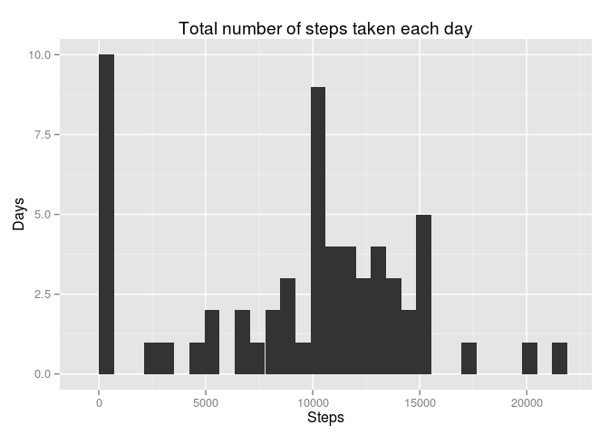

# Reproducible Research: Peer Assessment 1


## Loading and preprocessing the data


```r
# Unzip the file
unzip(zipfile = 'activity.zip', overwrite = TRUE)
# Read the file
data <- read.csv('./activity.csv') %>%
# Convert date and interval to POSIX dates
  mutate(date = ymd(date),
         interval = as.POSIXct(today() + hm(paste(interval %/% 100, ':',
                                                  interval %% 100,
                                                  sep = '')))) %>%
# Make sure the data is ordered correctly
  arrange(date, interval)
```

## What is mean total number of steps taken per day?


```r
# Calculate the sum of steps per day
stepsPerDay <- data %>%
  group_by(date) %>%
  summarize(steps = sum(steps, na.rm = TRUE))
# Calculate the summary data (mean, median)
summaryBeforeImpute <- stepsPerDay %>%
  summarise(mean = round(mean(steps, na.rm = TRUE), 2),
            median = round(median(steps, na.rm = TRUE), 2))
# Plot the histogram
qplot(x = steps, data = stepsPerDay, geom = 'histogram', 
      main = 'Total number of steps taken each day',
      xlab = 'Steps', ylab = 'Days')
```

 

The mean of the total number of steps taken per day is:
9354.23.  
The median of the total number of steps taken per day is:
10395.  

## What is the average daily activity pattern?


```r
# Calculate the mean of steps per interval
stepsPerInterval <- data %>%
  group_by(interval) %>%
  summarize(steps = mean(steps, na.rm = TRUE))
# Plot the time series
qplot(x = interval, y = steps, data = stepsPerInterval, geom = 'line',
      main = 'Average daily activity', xlab = '5-minute interval',
      ylab = 'Average number of steps') +
  scale_x_datetime(breaks = '4 hours', labels = date_format('%H:%M'))
```

 

```r
# Keep only the line corresponding to the maximum mean
stepsPerInterval <- stepsPerInterval %>%
  filter(steps == max(steps)) %>%
  mutate(steps = round(steps, 2))
```

The interval with the maximum number of steps is at
08:35 (206.17 steps on
average).

## Imputing missing values


```r
# Count the nomber of incomplete cases
incompleteRowCount <- sum(!complete.cases(data))
```

The total number of rows with NAs is: 2304  

The imputing strategy consists in replacing the NAs with the mean of the number
of steps taken in the same interval on all days.


```r
# Define a function for imputing a missing value with the mean of the
# values for the corresponding interval 
impute <- function(x) replace(x, is.na(x), mean(x, na.rm = TRUE))
# Impute the missing data
newData <- data %>%
  ddply(~ interval, transform, steps = impute(steps)) %>%
# Make sure the data is still ordered correctly
  arrange(date, interval)
# Calculate the sum of steps per day
stepsPerDay <- newData %>%
  group_by(date) %>%
  summarize(steps = sum(steps, na.rm = TRUE))
# Calculate the summary data (mean, median)
summaryAfterImpute = stepsPerDay %>%
  summarise(mean = round(mean(steps, na.rm = TRUE), 2),
            median = round(median(steps, na.rm = TRUE), 2))
# Plot the histogram
qplot(x = steps, data = stepsPerDay, geom = 'histogram', 
      main = 'Total number of steps taken each day',
      xlab = 'Steps', ylab = 'Days')
```

 

The new mean of the total number of steps taken per day is: 
10766.19, compared to the previous 
9354.23, a difference of 
1411.96.  
The median of the total number of steps taken per day is: 
10766.19, compared to the previous 
10395, a difference of 
371.19.  
As a result of imputing the missing data, the new mean and median are now equal.

## Are there differences in activity patterns between weekdays and weekends?


```r
# Add a factor variable to differentiate between weekdays and weekends
newData <- newData %>%
  mutate(daytype = factor(!(wday(date) %in% 2:6),
                          labels = c('weekday', 'weekend')))
# Plot the time series
qplot(x = interval, y = steps, data = newData, geom = 'line', stat = 'summary',
      fun.y = 'mean', main = 'Average daily activity',
      xlab = '5-minute interval', ylab = 'Average number of steps') +
  facet_wrap(~ daytype, ncol = 1) +
  scale_x_datetime(breaks = '4 hours', labels = date_format('%H:%M'))
```

 
